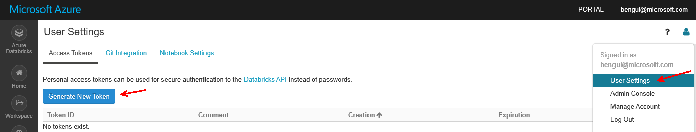

# demo 3 setup

## prerequisites

- Have an [Azure](https://azure.com) subscription
- [install Azure CLI](https://docs.microsoft.com/en-us/cli/azure/install-azure-cli)
- [install Azure Databricks CLI](https://docs.azuredatabricks.net/user-guide/dev-tools/databricks-cli.html#install-the-cli)
- setup the required variables in your ~/.profile or equivalent as explained in `initvars.sh`

This bash code was tested from a Windows Subsystem for Linux (Ubuntu 16.04.5 LTS) on Windows 10 (Version 1809 OS Build 17763.253)

## create the resources

The resources are:
- Azure Databricks workspace
- Azure Event Hubs
- Azure Monitor workspace
- Application Insights
- a custom dashboard

```bash
cd "${_azmon1901_path}/code"
source ./initvars.sh
source ./initazlogin.sh
source ./demo3/src1_setup.sh
```



```bash
source ./demo3/src2_setup.sh
source ./demo3/src3_setuprequestbininstance.sh
source ./demo3/src4_azmon_createalerts.sh
source ./demo3/src5_runjobs.sh
```

